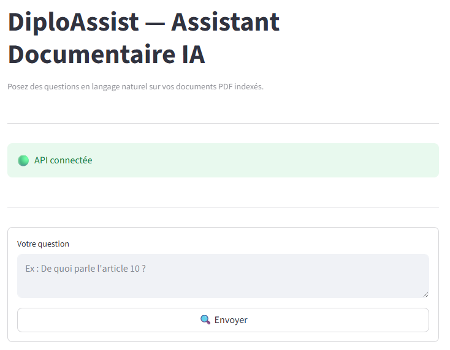
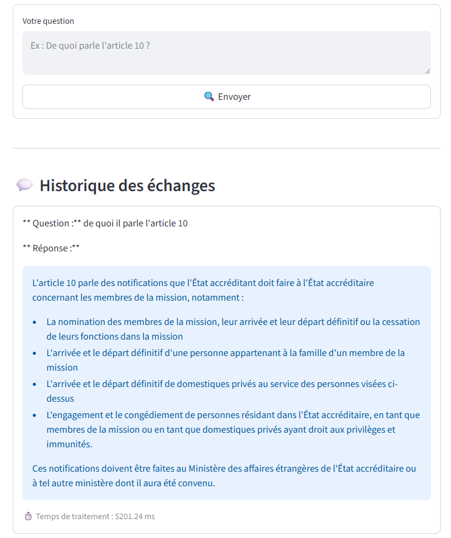

# 📄 DiploAssist —  Assistant Documentaire IA

> DiploAssist est un assistant IA spécialisé dans l'analyse de documents complexes,
> capable de **résumer**, **expliquer** et **structurer** rapidement des informations
> pour gagner du temps et améliorer la compréhension.
>
> Propulsé par un pipeline **RAG** (Retrieval-Augmented Generation) :
> vos documents PDF deviennent interrogeables en langage naturel.
<p align="center">
  
</p>

**Auteur :** Nabila ASKEUR  
**Stack :** FastAPI · LangChain · FAISS · Groq (Llama 3.3) · Streamlit · Docker


---

## 🧠 Architecture


```
┌─────────────────┐
│  PDF Files      │
│ data/documents  │
└────────┬────────┘
         │
         ▼
┌─────────────────────┐
│  Ingestion & Chunking│
└────────┬────────────┘
         │
         ▼
┌─────────────────────┐        ┌──────────────┐
│ HuggingFace         │──────► │ Index FAISS  │
│ Embeddings          │        └──────┬───────┘
└─────────────────────┘               │
                                      │ Retrieval
┌─────────────────────┐               │ (top-k chunks)
│     Question        │ ──────────────►│
│    utilisateur      │               │
└─────────────────────┘               ▼
                              ┌──────────────────┐
                              │ Groq LLM         │
                              │ (Llama 3.3 70B)  │
                              └──────┬───────────┘
                                     │
                                     ▼
                              ┌──────────────────┐
                              │   Réponse        │
                              │    générée       │
                              └──────────────────┘
```

---

## 🗂️ Structure du projet
```
diploassist/
├── api/
│   ├── app/
│      ├── services/
│      │   ├── ingestion.py       # Chargement & découpage des PDFs
│      │   └── rag_pipeline.py    # Pipeline FAISS + Groq LLM
│      └── main.py                # Endpoints FastAPI
│   
├── ui/
│   ├── app.py                     # Interface utilisateur
│   
├── data/
│   ├── documents/                 #  Déposer les PDFs ici
│   └── faiss_index/               # Généré automatiquement
├── docker-compose.yml
└── Dockerfile
├── .env
└── README.md
```
---

## ⚙️ Installation & Lancement

### Prérequis
- [Docker](https://www.docker.com/) & Docker Compose
- Une clé API Groq gratuite → [console.groq.com](https://console.groq.com)

### 1. Cloner le dépôt

```bash
git clone https://github.com/nabila/<nom-du-repo>.git
cd <nom-du-repo>
```

### 2. Configurer les variables d'environnement

```bash
cp .env.env
```

Remplir `.env` :

```env
GROQ_API_KEY=gsk_xxxxxxxxxxxxxxxxxxxxxxxx
GROQ_MODEL=llama-3.3-70b-versatile
FAISS_INDEX_PATH=data/faiss_index
RETRIEVER_TOP_K=4
```

### 3. Ajouter vos documents PDF

```bash
cp vos_fichiers.pdf data/documents/
```

### 4. Lancer l'application

```bash
docker-compose up --build
```

---

## 🌐 Accès

| Service                |                      URL                                 |
|----------------------- |----------------------------------------------------------|
|  API FastAPI           | [http://localhost:8000](http://localhost:8000)           |
|  Documentation Swagger | [http://localhost:8000/docs](http://localhost:8000/docs) |
|  Interface Streamlit   | [http://localhost:8501](http://localhost:8501)           |

---

## 🔌 Endpoints API

| Méthode | Endpoint | Description |
|---|---|---|
| `POST` | `/query` | Poser une question sur les PDFs |
| `GET` | `/health` | Vérifier l'état de l'API |
| `GET` | `/docs` | Documentation Swagger interactive |

**Exemple de requête :**

```bash
curl -X POST http://localhost:8000/query \
  -H "Content-Type: application/json" \
  -d '{"question": "De quoi parle l article 10 ?"}'
```

**Réponse :**

```json
{
  "question": "De quoi parle l article 10 ?",
  "response": "L'article 10 traite de...",
  "duration_ms": 843.21
}
```
<p align="center">
  
</p>
---

## 🛠️ Stack technique

| Composant | Technologie |
|---|---|
| Backend API | FastAPI |
| Pipeline RAG | LangChain |
| Index vectoriel | FAISS |
| Embeddings | HuggingFace (`sentence-transformers`) |
| LLM | Groq — Llama 3.3 70B Versatile |
| Frontend | Streamlit |
| Conteneurisation | Docker & Docker Compose |

---

## 📄 Licence

Ce projet est sous licence MIT.  
© 2025 Nabila — Tous droits réservés.
